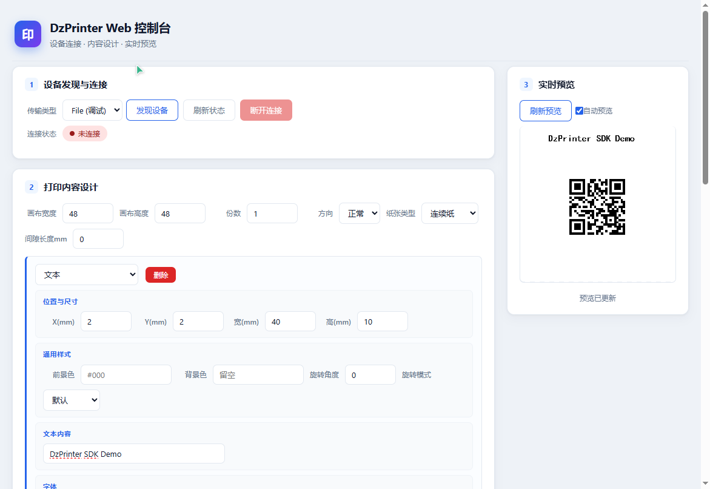
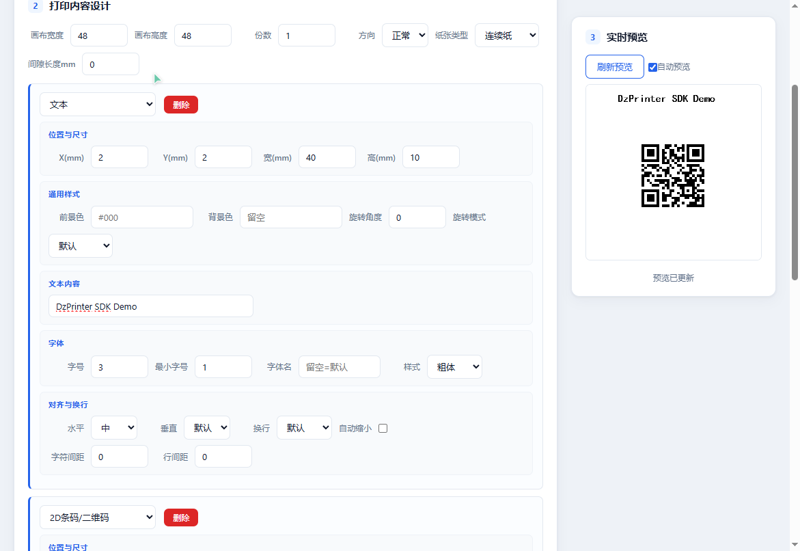

# DzPrinterCsharpSDK

[](https://dotnet.microsoft.com/)
[](https://learn.microsoft.com/en-us/dotnet/csharp/)

德佟（DeTong）热敏标签打印机 C# SDK，基于 .NET 8 开发。提供设备发现、连接管理、标签绘制（文本/图形/条码/图像）、协议编码与打印发送的一站式解决方案。

## 目录

- [功能特性](#功能特性)
- [项目结构](#项目结构)
- [快速开始](#快速开始)
- [核心 API 使用说明](#核心-api-使用说明)
  - [1. 设备发现与连接](#1-设备发现与连接)
  - [2. 标签绘制](#2-标签绘制)
  - [3. 打印输出](#3-打印输出)
  - [4. 条码生成](#4-条码生成)
  - [5. 图像绘制与处理](#5-图像绘制与处理)
  - [6. 设备管理（多设备）](#6-设备管理多设备)
  - [7. 打印机配置与验证](#7-打印机配置与验证)
  - [8. 打印机硬件信息](#8-打印机硬件信息)
- [9. 文件输出与 PNG 预览](#9-文件输出与-png-预览)
- [10. Web 服务器与 HTTP API](#10-web-服务器与-http-api)
- [枚举速查](#枚举速查)
- [依赖项](#依赖项)
- [许可证](#许可证)

---

## 功能特性

- **多种连接方式**：支持 BLE 低功耗蓝牙（`BleXPlatTransport`）、HID USB（`HidSharpTransport`）和文件输出（`FileTransport`）三种传输层
- **文件输出虚拟打印**：无需真实打印机即可将打印数据写入文件（二进制/十六进制文本），并自动解码协议字节流生成 PNG 预览图，便于调试与脱机分析
- **丰富的绘图能力**：文本、直线、矩形、圆角矩形、椭圆、圆、1D/2D 条码、图像
- **1D 条码支持**：Code128、EAN-13、EAN-8、UPC-A、UPC-E、Code39、ITF25、Codabar、Code93、ISBN、GS1-128 等
- **2D 条码支持**：QR Code、PDF417、DataMatrix、GridMatrix
- **高级文本布局**：自动换行、自动缩放、字符/行间距、反色、旋转
- **双单位模式**：毫米（mm）和像素（px）自适应切换
- **协议栈**：RLE 压缩分包、多页打印、DPI/浓度/速度配置
- **设备管理**：多设备并发连接、状态事件监听、自动关闭定时器
- **SkiaSharp 渲染**：跨平台 2D 图形引擎，与 JS SDK Canvas API 行为等价
- **Web 服务器**：内置 ASP.NET Core HTTP API 与可视化控制台，支持浏览器实时设计与预览标签

---

## 项目结构

```
DzPrinterCsharpSDK/
├── DzPrinter.Core/               # 核心工具：日志、字节操作、打印机状态辅助
├── DzPrinter.Transport/          # 传输层接口定义
├── DzPrinter.Transport.BleXPlat/ # BLE 实现（跨平台，基于 Plugin.BLE）
├── DzPrinter.Transport.Hid/      # Windows HID 实现（基于 HidSharp）
├── DzPrinter.Transport.File/     # 文件输出虚拟传输层（调试/测试/PNG 预览）
├── DzPrinter.Barcode/            # 1D/2D 条码编码引擎
├── DzPrinter.Drawing/            # 画布绘制（文本/图形/条码/图像）
├── DzPrinter.Imaging/            # 图像处理（二值化、半色调、反色等）
├── DzPrinter.Jobs/                # 作业管理：DzPrinterManager + DrawContext
├── DzPrinter.Printer/            # 设备管理 + 协议编码：DeviceManager + PrintEncoder + LPAPI
├── DzPrinter.Samples/            # 使用示例程序
├── DzPrinter.Web/                # ASP.NET Core Web 服务器：HTTP API + 可视化控制台
├── DzPrinter.Tests/              # 单元测试
└── docs/                          # 文档与截图
```

---

## 快速开始

### 1. 创建项目并添加引用

```bash
dotnet new console -n MyPrinterApp
cd MyPrinterApp
dotnet add reference ../DzPrinter.Jobs/DzPrinter.Jobs.csproj
dotnet add reference ../DzPrinter.Transport.Ble/DzPrinter.Transport.Ble.csproj
dotnet add reference ../DzPrinter.Transport.Hid/DzPrinter.Transport.Hid.csproj
# 如需文件输出虚拟打印（调试/测试）：
dotnet add reference ../DzPrinter.Transport.File/DzPrinter.Transport.File.csproj
```

### 2. 最简单的打印流程

```csharp
using DzPrinter.Drawing;
using DzPrinter.Jobs;
using DzPrinter.Printer;
using DzPrinter.Transport;
using DzPrinter.Transport.Ble;

// 注册 GBK 编码（打印机中文支持）
System.Text.Encoding.RegisterProvider(System.Text.CodePagesEncodingProvider.Instance);

// 创建 BLE 传输层
using var transport = new WinRtBleTransport(new BleTransportOptions
{
    ServiceUuid = new Guid("000018F0-0000-1000-8000-00805F9B34FB"),
    PackSize = 20,
    ScanTimeoutMs = 5000
});

// 创建管理器
using var manager = new DzPrinterManager(transport);

// 1) 扫描设备
var devices = await manager.DiscoverAsync();
if (devices.Count == 0) { Console.WriteLine("未发现设备"); return; }

// 2) 连接
await manager.ConnectAsync(devices[0]);

// 3) 绘制标签
using var ctx = manager.CreateDrawContext(new DrawJobOptions
{
    WidthMm = 48,
    HeightMm = 48,
    Orientation = 0,
    PrinterInfo = new PrinterInfo
    {
        PrinterDpi = 203,
        PrinterWidth = 384,
        PageCount = 1
    }
});
ctx.Start();

ctx.Canvas.DrawText(new DrawOptions
{
    Text = "Hello DzPrinter!",
    X = 5,
    Y = 5,
    FontHeight = 4,
});

// 4) 打印
var result = await manager.PrintAsync(ctx);
Console.WriteLine($"打印结果: {result}");

// 5) 断开
await manager.DisconnectAsync();
```

### 3. 运行示例

```bash
# 列出所有设备
dotnet run --project DzPrinter.Samples -- list

# BLE 打印
dotnet run --project DzPrinter.Samples -- ble

# HID 打印
dotnet run --project DzPrinter.Samples -- hid

# 文件输出（二进制 + PNG 预览），无需真实打印机
dotnet run --project DzPrinter.Samples -- file

# 文件输出（十六进制文本 + PNG 预览）
dotnet run --project DzPrinter.Samples -- file-hex

# 查看打印机信息（BLE）
dotnet run --project DzPrinter.Samples -- info-ble

# 查看打印机信息（HID）
dotnet run --project DzPrinter.Samples -- info-hid

# 查看信息并打印到标签
dotnet run --project DzPrinter.Samples -- info-ble --print
dotnet run --project DzPrinter.Samples -- info-hid --print
```

文件输出模式会将打印数据写入桌面 `DzPrinter_Output` 目录，生成：
- `label_<时间戳>.bin` 或 `.hex`：原始协议字节流（二进制或十六进制文本）
- `label_<时间戳>.png`：自动解码协议字节流生成的标签预览图（白底黑字，2 倍放大）
示例图片：

 

---

## 核心 API 使用说明

### 1. 设备发现与连接

#### 使用 `IDeviceTransport` 传输层

传输层是 SDK 的底层抽象，提供设备发现、连接、数据收发的统一接口。

**BLE 传输层**（Windows 平台，基于 WinRT）：

```csharp
using DzPrinter.Transport.Ble;

var bleTransport = new WinRtBleTransport(new BleTransportOptions
{
    ServiceUuid = new Guid("000018F0-0000-1000-8000-00805F9B34FB"),
    PackSize = 20,          // MTU-3，每包最大字节数
    ScanTimeoutMs = 5000,   // 扫描超时
});
```

**HID USB 传输层**（基于 HidSharp）：

```csharp
using DzPrinter.Transport.Hid;

var hidTransport = new HidSharpTransport(new HidTransportOptions
{
    VendorId = 0x0483,      // 可选：按 VID 过滤
    ProductId = 0x5750,     // 可选：按 PID 过滤
    NameContains = "Printer", // 可选：按名称模糊匹配
    ReportId = 0,
});
```

**文件输出虚拟传输层**（无需真实打印机，用于调试/测试）：

```csharp
using DzPrinter.Transport.File;

var fileTransport = new FileTransport(new FileTransportOptions
{
    OutputPath = "print_output.bin",  // 输出文件路径
    Format = FileOutputFormat.RawBinary, // 或 HexText（十六进制文本）
    SavePngPreview = true,              // 断开时自动生成 PNG 预览
    PngOutputPath = "print_output.png", // PNG 路径（可选，默认同路径同名）
    PngBackground = 1,                  // 0=黑底白字, 1=白底黑字（默认）
    PngScale = 2,                       // PNG 缩放倍数（1=1:1, 2=放大2倍）
});
```

`FileTransport` 的 `DiscoverAsync` 返回一台虚拟设备（`D60-File`），`ConnectAsync` 打开文件流，`SendAsync` 将字节写入文件，`DisconnectAsync` 关闭文件并（如启用）生成 PNG 预览。PNG 预览由内置的 `PrintPreviewDecoder` 实现，支持解码协议帧（PAGE_START/WIDTH、RAW BITMAP、REPEAT、RLEC/RLE5X/RLE5D/RLE6X/RLE6D）并渲染为位图。

#### 设备发现

```csharp
// 发现附近所有打印机
IReadOnlyList<DeviceInfo> devices = await transport.DiscoverAsync();

// 遍历设备
foreach (var device in devices)
{
    Console.WriteLine($"[{device.TransportType}] {device.DeviceName} (ID: {device.DeviceId})");
}
```

#### 连接与断开

```csharp
// 连接
await transport.ConnectAsync(devices[0]);

// 发送数据
await transport.SendAsync(dataBytes);

// 请求-响应模式
byte[]? response = await transport.RequestAsync(dataBytes, timeoutMs: 2000);

// 断开
await transport.DisconnectAsync();
```

#### 监听连接状态

```csharp
transport.ConnectionStateChanged += (sender, e) =>
{
    Console.WriteLine($"状态: {e.State}, 消息: {e.Message}");
};

transport.DataReceived += (sender, e) =>
{
    Console.WriteLine($"收到数据: {e.Data.Length} 字节");
};
```

---

### 2. 标签绘制

标签绘制通过 `DrawContext` + `PrinterCanvasMm` 实现。`PrinterCanvasMm` 是毫米单位画布，自动将 mm 转换为像素。

#### 创建绘制作业

```csharp
using DzPrinter.Jobs;
using DzPrinter.Drawing;
using DzPrinter.Printer;

// 创建作业选项
var options = new DrawJobOptions
{
    WidthMm = 60,           // 标签宽度（毫米）
    HeightMm = 40,          // 标签高度（毫米）
    Orientation = 0,        // 方向：0=正常, 1=90°, 2=180°, 3=270°
    PrinterInfo = new PrinterInfo
    {
        PrinterDpi = 203,       // 打印机 DPI
        PrinterWidth = 384,     // 打印机像素宽度
        GapType = LpaGapType.Gap,           // 间隙类型：None/Hole/Gap/Black/Trans
        GapLength = 3,          // 间隙长度（毫米）
        Darkness = LpaPrintDarkness.Normal, // 浓度
        Speed = LpaPrintSpeed.Normal,       // 速度
        PageCount = 1,          // 打印份数
    },
};

using var ctx = manager.CreateDrawContext(options);
var canvas = ctx.Start();   // 启动作业，获取画布
```

#### 绘制文本

```csharp
// 基础文本
canvas.DrawText(new DrawOptions
{
    Text = "产品名称",
    X = 5,                   // X 坐标（mm）
    Y = 5,                   // Y 坐标（mm）
    FontHeight = 4,          // 字体高度（mm）
    FontName = "黑体",
    Color = "#000",
});

// 居中对齐 + 自动换行
canvas.DrawText(new DrawOptions
{
    Text = "这是一段较长的描述文字，会自动换行显示",
    X = 5,
    Y = 10,
    Width = 50,              // 指定宽度以启用自动换行
    FontHeight = 3,
    HorizontalAlignment = Alignment.Center,
    AutoReturn = WrapMode.Char,
});

// 粗体 + 下划线
canvas.DrawText(new DrawOptions
{
    Text = "重要信息",
    X = 5,
    Y = 20,
    FontHeight = 4,
    FontStyle = FontStyle.Bold | FontStyle.Underline,
});

// 反色文本（白底黑字 → 黑底白字）
canvas.DrawText(new DrawOptions
{
    Text = "反色文字",
    X = 5,
    Y = 30,
    Width = 30,
    Height = 8,
    AntiColor = true,        // 布尔值自动应用反色+填充
});
```

#### 绘制图形

```csharp
// 直线
canvas.DrawLine(new DrawOptions
{
    X1 = 5, Y1 = 5,
    X2 = 55, Y2 = 5,
    LineWidth = 0.5,
    Color = "#000",
});

// 虚线
canvas.DrawLine(new DrawOptions
{
    X1 = 5, Y1 = 10,
    X2 = 55, Y2 = 10,
    DashLen = "2,2",         // 虚线模式：画2mm 空2mm
});

// 矩形
canvas.DrawRect(new DrawOptions
{
    X = 5, Y = 15,
    Width = 50, Height = 15,
    Fill = true,             // 填充
    Color = "#000",
});

// 圆角矩形
canvas.DrawRoundRect(new DrawOptions
{
    X = 5, Y = 15,
    Width = 50, Height = 15,
    Radius = 2,              // 圆角半径
    Fill = true,
});

// 圆
canvas.DrawCircle(new DrawOptions
{
    X = 30, Y = 20,          // 圆心
    Radius = 8,              // 半径
    Fill = true,
});

// 椭圆
canvas.DrawEllipse(new DrawOptions
{
    X = 20, Y = 15,
    Width = 30, Height = 20,
    Fill = true,
});
```

---

### 3. 打印输出

```csharp
// 方式一：通过 DzPrinterManager 打印（推荐）
var result = await manager.PrintAsync(ctx);

// 方式二：发送原始字节数据
await manager.SendRawAsync(rawData);

// 打印结果判断
if (result == LpaResult.Ok)
    Console.WriteLine("打印成功");
else
    Console.WriteLine($"打印失败: {result}");
```

`LpaResult` 枚举值：

| 值 | 含义 |
|---|---|
| `Ok` | 成功（0） |
| `ErrorParam` | 参数错误（1） |
| `ErrorNoPrinter` | 无打印机（2） |
| `ErrorDataSendError` | 数据发送错误（8） |

---

### 4. 条码生成

#### 1D 条码

```csharp
using DzPrinter.Barcode;
using DzPrinter.Drawing;

// 创建 1D 条码
var barcodeResult = Barcode1DCreator.Create1DBarcode(new Barcode1DRequest
{
    Text = "1234567890",
    BarcodeType = BarcodeType.EAN13,
    ShowStartEnd = false,
});

// 绘制 1D 条码到画布
canvas.Draw1DBarcode(new DrawOptions
{
    Datas = barcodeResult?.Items.Select(i => new BarcodeItem
    {
        Data = i.Data,
        Text = i.Text,
    }).ToList(),
    X = 5,
    Y = 5,
    Width = 50,
    Height = 15,
    TextHeight = 3,           // 条码下方文字高度
    TextAlignment = Alignment.Center,
    FontHeight = 3,
});
```

**支持的 1D 条码类型**（`BarcodeType` 枚举）：

| 类型 | 枚举值 | 说明 |
|---|---|---|
| UPC-A | `UpcA` | 12 位商品条码 |
| UPC-E | `UpcE` | 8 位压缩商品条码 |
| EAN-13 | `Ean13` | 欧洲商品编码 |
| EAN-8 | `Ean8` | 8 位欧洲商品编码 |
| Code39 | `Code39` | 工业标准条码 |
| Code93 | `Code93` | 高密度条码 |
| Code128 | `Code128` | 高密度字母数字条码 |
| ITF25 | `Itf25` | 交叉二五码 |
| ITF14 | `Itf14` | 14 位交叉二五码 |
| Codabar | `Codabar` | 库德巴码 |
| ISBN | `Isbn` | 国际标准书号 |
| GS1-128 | `GS1_128` | GS1 物流条码 |
| ChinaPost | `ChinaPost` | 中国邮政条码 |
| Matrix25 | `Matrix25` | 矩阵二五码 |
| Industrial25 | `Industrial25` | 工业二五码 |
| AUTO | `Auto` | 自动识别（默认） |

#### 2D 条码

```csharp
using DzPrinter.Barcode;

// 创建 QR 码
var qrMatrix = Barcode2DCreator.CreateQRCode(new Barcode2DRequest
{
    Text = "https://example.com",
    BarcodeType = Barcode2DType.QRCode,
});

// 绘制 2D 条码到画布
canvas.Draw2DBarcode(new DrawOptions
{
    Data = qrMatrix,          // BitMatrix
    X = 5,
    Y = 5,
    Width = 25,               // 条码宽度（mm）
    ZoneSize = 2,             // 静区大小（模块数）
    BarPixels = 4,            // 每模块像素数
    AutoScaleLevel = 2,       // 自动缩放级别
    HorizontalAlignment = Alignment.Center,
    VerticalAlignment = Alignment.Center,
});
```

**支持的 2D 条码类型**（`Barcode2DType` 静态类）：

| 类型 | 常量 | 说明 |
|---|---|---|
| QR Code | `QRCode` | 快速响应码 |
| PDF417 | `PDF417` | 便携式数据文件 |
| DataMatrix | `DMCode` | 数据矩阵码 |
| GridMatrix | `GMCode` | 网格矩阵码 |

#### 注册自定义编码器

```csharp
// 注册自定义 1D 条码编码器
Barcode1DCreator.RegisterBarcodeCreator(BarcodeType.Code128, new MyCustomEncoder());

// 注册自定义 2D 条码编码器
Barcode2DCreator.SetEncoder("MY_TYPE", new MyCustom2DEncoder());
```

---

### 5. 图像绘制与处理

#### 绘制图像

```csharp
using SkiaSharp;

// 从文件加载图片
var image = SKBitmap.Decode("logo.png");

// 绘制到画布
canvas.DrawImage(new DrawOptions
{
    Image = image,
    X = 5,
    Y = 5,
    Width = 20,               // 目标宽度（mm）
    Height = 20,              // 目标高度（mm）
    HorizontalAlignment = Alignment.Center,
    VerticalAlignment = Alignment.Center,
});

// 裁剪绘制
canvas.DrawImage(new DrawOptions
{
    Image = image,
    Sx = 10, Sy = 10,         // 源裁剪起点
    Swidth = 100, Sheight = 100, // 源裁剪尺寸
    X = 5, Y = 5,             // 目标位置
    Width = 20, Height = 20,  // 目标尺寸
});
```

#### 图像效果

```csharp
// 反色（黑白反转）
canvas.InverseColors();

// 水平翻转
canvas.HorizontalFlip();

// 获取像素数据
var imageData = canvas.GetImageData();
Console.WriteLine($"尺寸: {imageData.Width}x{imageData.Height}");
```

#### 九宫格缩放

```csharp
// 九宫格缩放（适合标签边框等场景）
canvas.DrawImageResizeLabel(new DrawOptions
{
    Image = borderImage,
    Left = 3,                 // 左边距
    Top = 3,                  // 上边距
    Right = 3,                // 右边距
    Bottom = 3,               // 下边距
    FullOfLabel = true,       // 铺满标签
    TileMode = false,         // false=拉伸, true=平铺
});
```

---

### 6. 设备管理（多设备）

`DeviceManager` 提供多设备并发管理能力，适用于需要同时连接多台打印机的场景。

```csharp
using DzPrinter.Printer;
using DzPrinter.Transport.Ble;
using DzPrinter.Transport.File;
using DzPrinter.Transport.Hid;

// 创建设备管理器（注入传输层工厂）
var manager = new DeviceManager(type =>
{
    return type switch
    {
        LpaDeviceType.Ble  => new WinRtBleTransport(new BleTransportOptions()),
        LpaDeviceType.UsbHid => new HidSharpTransport(new HidTransportOptions()),
        LpaDeviceType.File => new FileTransport(new FileTransportOptions { SavePngPreview = true }),
        _ => throw new NotSupportedException()
    };
});

// 订阅事件
manager.DeviceFound += device =>
    Console.WriteLine($"发现设备: {device.Name}");

manager.ConnectionStateChanged += (info, state) =>
    Console.WriteLine($"设备 {info?.DeviceName} 状态: {state}");

// 发现所有支持的打印机
var printers = await manager.DiscoverAsync(
    deviceType: LpaDeviceType.Auto,
    filterSupported: true
);

// 连接指定设备
var connection = await manager.ConnectAsync(printers[0]);

// 获取所有已连接设备
var connected = manager.ConnectedDevices;

// 断开指定设备
await manager.DisconnectAsync(deviceId);

// 断开所有设备
await manager.DisconnectAllAsync();
```

---

### 7. 打印机配置与验证

`DzPrinter` 静态工具类提供打印机名称解析、型号验证等功能。

```csharp
using DzPrinter.Printer;

// 设置支持的机型
DzPrinter.SetSupportModels("D110;D200;D300");

// 设置渠道列表
DzPrinter.SetTrades("D;O;#A;#B");

// 设置 BLE 过滤器
DzPrinter.SetBleFilters(new[] { "DZ-", "DT-" });

// 解析打印机名称
var info = DzPrinter.GetPrinterNameInfo("DZ-D110-DO12345678");
// info.Model     → "DZ-D110-DO12345678"
// info.Serials   → "12345678"
// info.Trade     → "O"
// info.CheckSum  → 校验和

// 判断是否为支持的设备
bool supported = DzPrinter.IsSupportedDevice("DZ-D110-DO12345678");

// 判断渠道类型
bool isSuper = DzPrinter.IsSupperTrade("D");
bool tradeOk = DzPrinter.IsTradeSupported("A", new[] { "A", "B" });
```

---

### 8. 打印机硬件信息

`GetPrinterInfoAsync` 方法查询打印机的硬件信息，包括 DPI、打印宽度、缓冲区大小、电池状态等。

#### 基本用法

```csharp
// 查询打印机硬件信息
var hwInfo = await manager.Api.GetPrinterInfoAsync(timeoutMs: 3000);
if (hwInfo != null)
{
    Console.WriteLine($"DPI: {hwInfo.Dpi}");
    Console.WriteLine($"打印宽度: {hwInfo.PrinterWidth} px");
    Console.WriteLine($"缓冲区: {hwInfo.BufferSize} bytes");
    Console.WriteLine($"电池数量: {hwInfo.BatteryCount}");
    Console.WriteLine($"电池电压: {hwInfo.BatteryVoltage:F2} V");
    Console.WriteLine($"充电状态: {(hwInfo.ChargeStatus ? "充电中" : "未充电")}");
    Console.WriteLine($"硬件标志: 0x{(uint)hwInfo.HardwareFlags:X8}");
    Console.WriteLine($"软件标志: 0x{(uint)hwInfo.SoftwareFlags:X8}");
}

// 查询打印机状态
var status = await manager.Api.GetPrintableStatusAsync();
Console.WriteLine($"打印机状态: {status}");
```

#### PrinterHardwareInfo 字段

| 字段 | 类型 | 说明 |
|---|---|---|
| `Dpi` | `int` | 打印机 DPI 分辨率（如 203） |
| `PrinterWidth` | `int` | 打印像素宽度（如 384） |
| `BufferSize` | `int` | 缓冲区大小（bytes） |
| `HardwareFlags` | `HardwareFlags` | 硬件能力标志（位掩码） |
| `SoftwareFlags` | `SoftwareFlags` | 软件能力标志（位掩码） |
| `BatteryCount` | `int` | 电池数量 |
| `BatteryVoltage` | `double` | 电池电压（V） |
| `ChargeStatus` | `bool` | 是否正在充电 |

#### 查询流程

该方法内部按以下顺序逐条发送命令并等待响应：

| 步骤 | 命令 | 说明 |
|---|---|---|
| 1 | `CMD_PRINTER_DPI (0x71)` | 获取 DPI 分辨率 |
| 2 | `CMD_PRINTER_WIDTH (0x72)` | 获取打印宽度 |
| 3 | `CMD_ENABLE_SETTING [0x7F]` | 启用设置模式 |
| 4 | `CMD_HARDWARE_FLAGS [0x01]` | 获取硬件/软件标志 + 电池数量 |
| 5 | `CMD_REQ_ADCVALUE [ADCEVT_POWER]` | 获取电池电压/充电状态 |
| 6 | `CMD_ENABLE_SETTING [0x00]` | 禁用设置模式 |
| 7 | `CMD_BUFFER_SIZE (0x77)` | 获取缓冲区大小 |

> **注意**：步骤 3-6 必须逐条发送并等待响应，不能合并发送。电池查询（步骤 5）必须在设置模式启用期间发送（步骤 3 之后、步骤 6 之前），否则设备不响应。

#### 打印机状态码（PrinterStatusCode）

| 值 | 枚举 | 说明 |
|---|---|---|
| 0 | `DZIP_PRINTABLE` | 可打印 |
| 1 | `DZIP_ISPRINTING` | 打印中 |
| 2 | `DZIP_ISROTATING` | 进纸中 |
| 30 | `DZIP_VOLTOOLOW` | 电量过低 |
| 31 | `DZIP_VOLTOOHIGH` | 电量过高 |
| 33 | `DZIP_TPHTOOHOT` | 打印头温度过高 |
| 34 | `DZIP_COVEROPENED` | 盖板已打开 |
| 35 | `DZIP_NO_PAPER` | 缺纸 |

---

### 9. 文件输出与 PNG 预览

`FileTransport` 是一个虚拟传输层，将打印数据写入本地文件而非发送到真实打印机。适用于：

- **调试**：将打印数据保存到文件，用十六进制工具逐帧分析协议
- **测试**：无需真实打印机即可验证绘制与编码逻辑
- **预览**：自动解码协议字节流生成 PNG 预览图，直观查看打印效果

#### 基本用法

```csharp
using DzPrinter.Transport.File;
using DzPrinter.Jobs;
using DzPrinter.Printer;

// 1. 创建文件传输层（启用 PNG 预览）
using var transport = new FileTransport(new FileTransportOptions
{
    OutputPath = "output.bin",       // 原始数据文件
    Format = FileOutputFormat.RawBinary, // 或 HexText
    SavePngPreview = true,           // 启用 PNG 预览
    PngOutputPath = "output.png",    // PNG 输出路径
    PngBackground = 1,               // 1=白底黑字, 0=黑底白字
    PngScale = 2,                    // 放大 2 倍
});

using var manager = new DzPrinterManager(transport);

// 2. 发现虚拟设备并连接
var devices = await manager.DiscoverAsync(LpaDeviceType.File);
await manager.ConnectAsync(devices[0]);

// 3. 绘制 + 打印（写入文件）
using var ctx = manager.CreateDrawContext(new DrawJobOptions
{
    WidthMm = 60, HeightMm = 40,
    PrinterInfo = new PrinterInfo { PrinterDpi = 203, PrinterWidth = 384 },
});
ctx.Start();
ctx.Canvas.DrawText(new DrawOptions { Text = "Test", X = 5, Y = 5, FontHeight = 4 });
await manager.PrintAsync(ctx);

// 4. 断开（关闭文件 + 生成 PNG）
await manager.DisconnectAsync();
// → output.bin 已写入
// → output.png 已生成
```

#### 输出格式

| 格式 | 枚举值 | 说明 |
|---|---|---|
| 原始二进制 | `FileOutputFormat.RawBinary` | 直接写入原始字节（`.bin`），可供重放 |
| 十六进制文本 | `FileOutputFormat.HexText` | 每行带时间戳的十六进制文本（`.hex`），便于阅读 |

#### PNG 预览

PNG 预览由 `PrintPreviewDecoder` 实现，支持解码以下协议帧：

| 命令 | 说明 |
|---|---|
| `CMD_PAGE_WIDTH` | 页面宽度（确定位图字节宽度） |
| `CMD_BITMAP_PRINT` | 原始位图行数据 |
| `CMD_BITMAP_REPEAT` | 重复上一行 |
| `CMD_BITMAP_RLEC` | RLEC 压缩行 |
| `CMD_BITMAP_RLE5X/RLE5D` | RLE5 压缩行（独立/差分） |
| `CMD_BITMAP_RLE6X/RLE6D` | RLE6 压缩行（独立/差分） |

#### 独立使用解码器

```csharp
using DzPrinter.Transport.File;

// 从已保存的 .bin 文件解码并生成 PNG
var bytes = File.ReadAllBytes("output.bin");
var result = PrintPreviewDecoder.Decode(bytes);
if (result.Success)
{
    PrintPreviewDecoder.SavePng(result, "preview.png", background: 1, scale: 2);
    Console.WriteLine($"解码成功: {result.PixelWidth}x{result.PixelHeight}");
}
else
{
    foreach (var w in result.Warnings)
        Console.WriteLine($"警告: {w}");
}
```

---

## 10. Web 服务器与 HTTP API

`DzPrinter.Web` 是基于 ASP.NET Core 的 Web 服务，通过 HTTP API 暴露打印机 SDK 的全部能力，并内置可视化控制台，可在浏览器中完成设备连接、标签设计、实时预览与打印。

### 快速启动

```bash
cd DzPrinter.Web
dotnet run
```

默认监听地址（见 `Properties/launchSettings.json`）：

- HTTPS: `https://localhost:11980`
- HTTP: `http://localhost:11981`

启动后浏览器自动打开控制台，也可手动访问 `http://localhost:11981/`。

### 可视化控制台

控制台（`wwwroot/index.html`）提供四块功能区域：

1. **设备发现与连接**：选择 File / BLE / HID 传输类型，搜索并连接打印机
2. **打印内容设计**：以指令列表方式组织画布——文本、矩形、圆角矩形、直线、圆形、椭圆、1D 条码、2D 条码、图片，每条指令可独立配置位置、尺寸、样式与编码参数
3. **实时预览**：修改任意参数后自动调用 `/api/print/preview` 生成 PNG 预览（基于 SkiaSharp 渲染，所见即所得）
4. **API 响应**：展示每个请求的原始 JSON 响应，便于调试

控制台总览：



内容设计区域（指令编辑 + 实时预览）：



### 配置

`appsettings.json` 控制默认传输类型与各传输层参数：

```json
{
  "Printer": {
    "Transport": "file",
    "File": {
      "OutputPath": "output/print.bin",
      "Format": "RawBinary",
      "SavePngPreview": true,
      "PngOutputPath": "output/preview.png",
      "PngScale": 2
    },
    "Ble": {
      "ServiceUuid": "000018f0-0000-1000-8000-00805f9b34fb",
      "PackSize": 20,
      "ScanTimeoutMs": 5000
    },
    "Hid": {
      "NameContains": "Printer",
      "ReportId": 0,
      "ReadTimeoutMs": 500,
      "WriteTimeoutMs": 2000,
      "SendIntervalMs": 20
    }
  }
}
```

| 字段 | 说明 |
|---|---|
| `Printer:Transport` | 默认传输类型：`file` / `ble` / `hid` |
| `Printer:File:*` | File 传输层参数，参见 [9. 文件输出与 PNG 预览](#9-文件输出与-png-预览) |
| `Printer:Ble:*` | BLE 传输层参数：服务 UUID、分包大小、扫描超时 |
| `Printer:Hid:*` | HID 传输层参数：名称过滤、报告 ID、读写超时、发送间隔 |

### HTTP API 一览

| 方法 | 路径 | 说明 |
|---|---|---|
| `GET` | `/api/devices/discover?transport={file\|ble\|hid}` | 发现设备 |
| `POST` | `/api/devices/connect` | 连接设备（Body: `{ "deviceId": "..." }`） |
| `POST` | `/api/devices/disconnect` | 断开当前设备 |
| `GET` | `/api/devices/status` | 查询连接状态 |
| `GET` | `/api/devices/info` | 查询打印机硬件信息（DPI/宽度/电池等） |
| `GET` | `/api/devices/printable-status` | 查询可打印状态码 |
| `POST` | `/api/print/preview` | 只绘制不打印，返回 Base64 PNG 预览 |
| `POST` | `/api/print` | 绘制并打印，返回结果 + 预览 |
| `POST` | `/api/print/raw` | 发送 Base64 编码的原始协议数据 |

### 请求示例

**发现设备**

```bash
curl "http://localhost:11981/api/devices/discover?transport=file"
```

```json
{
  "devices": [
    {
      "deviceId": "D60-File",
      "name": "D60-File",
      "modelName": "D60",
      "rssi": 0,
      "deviceType": "File"
    }
  ]
}
```

**预览（不打印）**

```bash
curl -X POST "http://localhost:11981/api/print/preview" \
  -H "Content-Type: application/json" \
  -d '{
    "widthMm": 48,
    "heightMm": 48,
    "orientation": 0,
    "printerInfo": {
      "printerWidth": 384,
      "printerDpi": 203,
      "pageCount": 1,
      "gapType": "none"
    },
    "instructions": [
      {
        "type": "drawText",
        "x": 2, "y": 2, "width": 44, "height": 10,
        "text": "DzPrinter SDK",
        "fontHeight": 3,
        "fontStyle": "bold",
        "horizontalAlignment": "center"
      },
      {
        "type": "draw2DBarcode",
        "x": 14, "y": 15, "width": 20, "height": 20,
        "qrText": "https://github.com",
        "barcode2DType": "qrcode",
        "eccLevel": "M",
        "zoneSize": 2,
        "barPixels": 4,
        "autoScaleLevel": 2
      }
    ]
  }'
```

返回值包含 `previewBase64` 字段，可直接用于 ``。

**连接并打印**

```bash
# 1. 发现设备
curl "http://localhost:11981/api/devices/discover?transport=ble"

# 2. 连接
curl -X POST "http://localhost:11981/api/devices/connect" \
  -H "Content-Type: application/json" \
  -d '{"deviceId":"XX:XX:XX:XX:XX:XX"}'

# 3. 打印（同 /api/print/preview 的 Body，改用 /api/print）
curl -X POST "http://localhost:11981/api/print" \
  -H "Content-Type: application/json" \
  -d '{...}'

# 4. 断开
curl -X POST "http://localhost:11981/api/devices/disconnect"
```

### 绘制指令 DTO

每条 `instructions` 数组元素对应一次画布调用，`type` 字段决定指令类型：

| `type` | 对应 API | 关键字段 |
|---|---|---|
| `drawText` | `Canvas.DrawText` | `text`, `fontHeight`, `fontName`, `fontStyle`, `horizontalAlignment`, `autoReturn`, `charSpace`, `lineSpace` |
| `drawRect` | `Canvas.DrawRect` | `fill`, `lineWidth`, `lineJoin`, `borderAlign`, `dashLens` |
| `drawRoundRect` | `Canvas.DrawRoundRect` | `fill`, `lineWidth`, `radius`, `dashLens` |
| `drawLine` | `Canvas.DrawLine` | `x1`, `y1`, `x2`, `y2`, `lineWidth`, `dashLens` |
| `drawCircle` | `Canvas.DrawCircle` | `x`, `y`, `radius`, `fill`, `lineWidth` |
| `drawEllipse` | `Canvas.DrawEllipse` | `fill`, `lineWidth` |
| `draw1DBarcode` | `Canvas.Draw1DBarcode` | `barcodeData`, `barcodeType`, `textHeight`, `textPosition`, `textAlign` |
| `draw2DBarcode` | `Canvas.Draw2DBarcode` | `qrText`, `barcode2DType`, `eccLevel`, `qrVersion`, `qrMask`, `zoneSize`, `barPixels`, `autoScaleLevel` |
| `drawImage` | `Canvas.DrawImage` | `imageBase64`, `imageUrl`, `sx`, `sy`, `swidth`, `sheight` |

通用字段（所有指令均支持）：`x`, `y`, `width`, `height`, `rotation`, `color`, `bgColor`, `rotateMode`, `padding`。

---

## 枚举速查

### 连接状态（`ConnectionState`）

| 值 | 含义 |
|---|---|
| `Disconnected` | 未连接 |
| `Connecting` | 正在连接 |
| `Connected` | 已连接 |
| `Disconnecting` | 正在断开 |
| `Failed` | 连接失败 |

### 传输类型（`TransportType`）

| 值 | 含义 |
|---|---|
| `BluetoothLowEnergy` | BLE 低功耗蓝牙 |
| `HidUsb` | HID USB |
| `BluetoothClassic` | 经典蓝牙 SPP |
| `TcpIp` | TCP/IP 网络 |
| `File` | 文件输出虚拟传输（调试/测试） |
| `Mock` | 模拟/测试 |

### 对齐方式（`Alignment`）

| 值 | 含义 |
|---|---|
| `Start` | 起始（左/上） |
| `Center` | 居中 |
| `End` | 结束（右/下） |
| `Stretch` | 拉伸/两端对齐 |

### 字体样式（`FontStyle`，位标志）

| 值 | 含义 |
|---|---|
| `Regular` | 常规 |
| `Bold` | 粗体 |
| `Italic` | 斜体 |
| `Underline` | 下划线 |
| `Strikeout` | 删除线 |

### 旋转模式（`RotateMode`）

| 值 | 含义 |
|---|---|
| `Auto` | 自动 |
| `RotateCanvas` | 旋转画布 |
| `RotateContent` | 旋转内容 |

### 反色模式（`AntiColorMode`，位标志）

| 值 | 含义 |
|---|---|
| `None` | 无反色 |
| `AntiColor` | 反前景色 |
| `AntiBackground` | 反背景色 |
| `FillFull` | 整块填充 |

### 换行模式（`WrapMode`）

| 值 | 含义 |
|---|---|
| `None` | 不换行 |
| `Char` | 按字符换行 |
| `Word` | 按单词换行 |

### 间隙类型（`LpaGapType`）

| 值 | 含义 |
|---|---|
| `None` | 无间隙 |
| `Hole` | 孔洞定位 |
| `Gap` | 间隙定位 |
| `Black` | 黑标定位 |
| `Trans` | 透明定位 |

### 打印浓度（`LpaPrintDarkness`）

| 值 | 含义 |
|---|---|
| `Min` | 最淡（1） |
| `Low` | 低（4） |
| `Normal` | 正常（6） |
| `High` | 高（10） |
| `Max` | 最浓（15） |

### 打印速度（`LpaPrintSpeed`）

| 值 | 含义 |
|---|---|
| `Min` | 最慢（1） |
| `Low` | 慢（2） |
| `Normal` | 正常（3） |
| `High` | 快（4） |
| `Max` | 最快（5） |

### 设备类型（`LpaDeviceType`）

| 值 | 含义 |
|---|---|
| `Auto` | 自动检测 |
| `Ble` | BLE 低功耗蓝牙 |
| `UsbHid` | HID USB |
| `File` | 文件输出虚拟打印（调试/测试） |

### API 操作结果（`LpaResult`）

| 值 | 含义 |
|---|---|
| `Ok` | 成功（0） |
| `ErrorParam` | 参数错误（1） |
| `ErrorNoPrinter` | 无打印机（2） |
| `ErrorDisconnected` | 已断开（3） |
| `ErrorConnectFailed` | 连接失败（4） |
| `ErrorDataSendError` | 数据发送错误（8） |
| `ErrorResponseTimeout` | 响应超时（11） |
| `ErrorCancel` | 已取消（25） |

---

## 依赖项

| 包名 | 用途 | 版本 |
|---|---|---|
| [SkiaSharp](https://www.nuget.org/packages/SkiaSharp) | 2D 图形渲染引擎 | 2.88+ |
| [HidSharp](https://www.nuget.org/packages/HidSharp) | HID USB 通信 | 2.x |
| [Windows.Devices.Bluetooth](https://learn.microsoft.com/en-us/uwp/api/windows.devices.bluetooth) | BLE 通信（WinRT） | 8.0+ |

---

## 许可证

本项目仅供德佟打印机相关应用开发学习使用。
